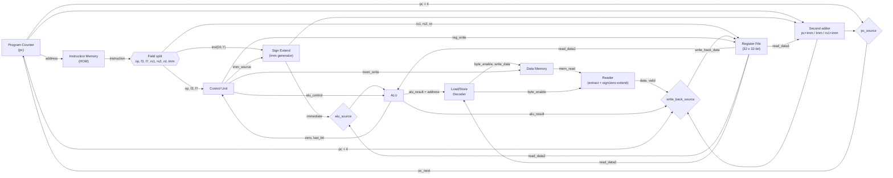

# RISC-V Single-Cycle Core (RV32I)


A **32-bit, single-cycle RISC-V processor core** designed at RTL level in **SystemVerilog** and verified with **Python-based [cocotb](https://www.cocotb.org/) testbenches** running on **Verilator**. Every instruction completes in exactly one clock cycle (CPI = 1), and both the individual hardware blocks and the full core's instruction behaviour are tested.

The whole project was developed and simulated on EDA Playground:
**[Open the project on EDA Playground](https://www.edaplayground.com/x/bgue)**

---

## Table of Contents

1. [Features](#1-features)
2. [Architecture](#2-architecture)
3. [Module Reference](#3-module-reference)
4. [Instruction Set Support](#4-instruction-set-support)
5. [Control Unit](#5-control-unit)
6. [Memory Access: Load/Store Handling](#6-memory-access-loadstore-handling)
7. [Verification](#7-verification)
8. [Repository Structure](#8-repository-structure)
9. [Getting Started](#9-getting-started)
10. [Design Notes and Limitations](#10-design-notes-and-limitations)
11. [Roadmap](#11-roadmap)
12. [Author](#12-author)

---

## 1. Features

- **RV32I base integer ISA**: arithmetic/logic, shifts, comparisons, loads/stores (byte, half-word, word), conditional branches, `JAL`/`JALR`, `LUI`/`AUIPC`.
- **Single-cycle datapath**: fetch, decode, execute, memory access and write-back all happen within one clock period.
- **Modular RTL**: ALU, control unit, register file, immediate generator, memory, load/store decoder and load reader are separate, individually testable modules.
- **Shared package** (`core_pkg_file`) holding opcodes, `funct3`/`funct7` encodings and ALU control codes, so no magic numbers appear in the RTL.
- **Safe handling of illegal encodings**: invalid shift-immediate encodings and unsupported opcodes do not modify the register file or memory.
- **Misaligned memory accesses are suppressed**: a misaligned store does not write, a misaligned load does not update the destination register.
- **Python verification with cocotb + Verilator**: unit tests per block plus an instruction-level test of the complete core that executes a hand-assembled program and checks results after every instruction.

---

## 2. Architecture

The core follows the classic single-cycle organisation with a **Harvard-style** split: instructions are read from an instruction memory (used as a ROM) and data is accessed through a separate data memory.



### Datapath walk-through

1. **Fetch:** the program counter (`pc`, reset to `0`) addresses the instruction memory, which combinationally returns the 32-bit `instruction`.
2. **Decode:** the instruction is sliced into `op` `[6:0]`, `funct3` `[14:12]`, `funct7` `[31:25]`, `rs1` `[19:15]`, `rs2` `[24:20]`, `rd` `[11:7]` and the raw immediate bits `[31:7]`. The control unit decodes `op/funct3/funct7` into all datapath controls while the register file reads both source registers.
3. **Execute:** the ALU operates on `rs1` and either `rs2` or the sign-extended immediate (`alu_source` mux). It also produces `zero` and `last_bit` flags used for branch decisions.
4. **Memory:** for loads and stores, the ALU result is the address. The load/store decoder generates the byte-enable mask and aligns store data; the data memory is always accessed at the word-aligned address `{alu_result[31:2], 2'b00}`.
5. **Write-back:** a 4-way mux selects what is written to `rd`:

   | `write_back_source` | Value written | Used by |
   |---|---|---|
   | `2'b00` | ALU result | R-type, I-type ALU |
   | `2'b01` | Memory read data (after the reader) | Loads |
   | `2'b10` | `pc + 4` | `JAL`, `JALR` |
   | `2'b11` | Output of the second adder (`pc + imm` or `imm`) | `AUIPC`, `LUI` |

6. **Next PC:** `pc_next` is `pc + 4` unless `pc_source` is set (taken branch or jump), in which case it is the output of the **second adder**:

   | `second_add_source` | Second adder result | Used by |
   |---|---|---|
   | `2'b00` | `pc + immediate` | Branches, `JAL`, `AUIPC` |
   | `2'b01` | `immediate` | `LUI` |
   | `2'b10` | `rs1 + immediate` | `JALR` |

Reusing one adder for branch targets, `JAL`, `JALR`, `LUI` and `AUIPC` keeps the datapath small.

---

## 3. Module Reference

| File | Module | Role |
|---|---|---|
| `design.sv` | `cpu` | **Top level.** Program counter, next-PC and write-back muxes, instantiation and wiring of all blocks. |
| `control.sv` | `control` | Main decoder + ALU decoder + branch logic. Generates `alu_control`, `imm_source`, `mem_write`, `reg_write`, `alu_source`, `write_back_source`, `pc_source`, `second_add_source`. |
| `core_pkg_file.sv` | `core_pkg_file` (package) | Opcode, `funct3`, `funct7` and ALU-operation constants shared by RTL. |
| `alu.sv` | `alu` | Arithmetic/logic unit (ADD, SUB, AND, OR, XOR, SLT, SLTU, SLL, SRL, SRA) with `zero` and `last_bit` outputs. |
| `regfile.sv` | `regfile` | 32 x 32-bit register file, two read ports, one write port (`write_enable` gated by `reg_write & wb_valid`). |
| `signext.sv` | `signext` | Immediate generator; selects the I/S/B/J/U format from `imm_source` and sign-extends to 32 bits. |
| `memory.sv` | `memory` | Word-organised memory with byte-enable writes and hex-file initialisation. Instantiated twice: as instruction ROM (writes tied off) and as data memory. |
| `load_store_decode.sv` | `load_store_decoder` | Derives the byte-enable mask and shifts store data into the right byte lanes from the address offset and `funct3`. Marks misaligned accesses by producing an empty mask. |
| `reader.sv` | `reader` | Extracts the addressed byte/half-word/word from the memory word, applies sign or zero extension according to `funct3`, and raises `valid` only for legal accesses. |

### Immediate formats (`imm_source`)

| `imm_source` | Format | Instructions |
|---|---|---|
| `3'b000` | I-type | Loads, ALU-immediate, `JALR` |
| `3'b001` | S-type | Stores |
| `3'b010` | B-type | Branches |
| `3'b011` | J-type | `JAL` |
| `3'b100` | U-type | `LUI`, `AUIPC` |

---

## 4. Instruction Set Support

| Category | Instructions |
|---|---|
| Register-register (R-type) | `ADD` `SUB` `SLL` `SLT` `SLTU` `XOR` `SRL` `SRA` `OR` `AND` |
| Register-immediate (I-type ALU) | `ADDI` `SLTI` `SLTIU` `XORI` `ORI` `ANDI` `SLLI` `SRLI` `SRAI` |
| Loads | `LB` `LH` `LW` `LBU` `LHU` |
| Stores | `SB` `SH` `SW` |
| Branches | `BEQ` `BNE` `BLT` `BGE` `BLTU` `BGEU` |
| Jumps | `JAL` `JALR` |
| Upper immediates | `LUI` `AUIPC` |

Not implemented: `FENCE`, `ECALL`/`EBREAK`, CSR instructions, and any extension beyond RV32I (M, A, C, ...). Unknown opcodes are treated as no-ops (no register or memory update) and print `Unknown/Unsupported OP CODE !` during simulation.

---

## 5. Control Unit

The control unit is purely combinational and is split in three parts.

**Main decoder** (from `op`):

| Instruction class | `reg_write` | `imm_source` | `mem_write` | `alu_source` | `write_back_source` | `alu_op` | Branch/Jump | `second_add_source` |
|---|---|---|---|---|---|---|---|---|
| Load | 1 | I | 0 | imm | memory (`01`) | `00` (add) | no | n/a |
| ALU immediate | 1 (*) | I | 0 | imm | ALU (`00`) | `10` | no | n/a |
| Store | 0 | S | 1 | imm | n/a | `00` (add) | no | n/a |
| R-type | 1 | n/a | 0 | reg2 | ALU (`00`) | `10` | no | n/a |
| Branch | 0 | B | 0 | reg2 | n/a | `01` (compare) | branch | `pc + imm` |
| `JAL` | 1 | J | 0 | n/a | `pc+4` (`10`) | n/a | jump | `pc + imm` |
| `JALR` | 1 | I | 0 | n/a | `pc+4` (`10`) | n/a | jump | `rs1 + imm` |
| `LUI` | 1 | U | 0 | n/a | second adder (`11`) | n/a | no | `imm` |
| `AUIPC` | 1 | U | 0 | n/a | second adder (`11`) | n/a | no | `pc + imm` |

(*) For `SLLI`, `SRLI` and `SRAI` the decoder validates the upper immediate bits (`funct7`): only `0000000` (SLLI/SRLI) and `0100000` (SRAI) are legal. Any other value forces `reg_write = 0`, so a malformed shift never changes architectural state.

**ALU decoder** (from `alu_op`, `funct3`, `funct7`): `alu_op = 00` always adds (address calculation); `10` decodes the arithmetic/logic operation from `funct3` (with `funct7` distinguishing `ADD`/`SUB` and `SRL`/`SRA`); `01` selects the comparison used by branches (subtract for `BEQ/BNE`, signed compare for `BLT/BGE`, unsigned compare for `BLTU/BGEU`).

**Branch logic:** using the ALU flags, the branch is taken when
`BEQ: zero`, `BNE: !zero`, `BLT/BLTU: last_bit`, `BGE/BGEU: !last_bit`, and `pc_source = assert_branch | jump`.

---

## 6. Memory Access: Load/Store Handling

Data memory is word-organised (32-bit words) but RISC-V is byte-addressed, so two helper blocks bridge the gap:

- **`load_store_decoder`** (store side and byte-enable generation): from the low address bits and `funct3` it creates a 4-bit `byte_enable` mask and positions the store data in the correct byte lanes. Misaligned requests produce an empty mask, so **nothing is written**.
- **`reader`** (load side): takes the word returned by the memory and the same byte-enable mask, extracts the requested `byte / half-word / word`, then sign-extends (`LB`, `LH`) or zero-extends (`LBU`, `LHU`). For illegal (misaligned) loads it drives `valid = 0`, and the top level gates the register-file write with `reg_write & wb_valid`, so **the destination register keeps its old value**.

Design choice: misaligned accesses are silently ignored rather than trapped, since the core has no exception/CSR machinery.

---

## 7. Verification

Verification is done entirely in Python with **cocotb** driving a **Verilator** simulation. Two levels are used.

### 7.1 Unit-level testbenches

Each hardware block has its own cocotb testbench that exercises it in isolation:

| Testbench | Block under test |
|---|---|
| `tb_alu.py` | ALU operations and flags |
| `tb_control.py` | Control signal generation per opcode/funct fields |
| `tb_regfile.py` | Register file reads/writes |
| `tb_signext.py` | Immediate decoding for each format |
| `tb_memory.py` | Memory reads, byte-enable writes |
| `tb_load_store.py` | Byte-enable / store-data generation |
| `tb_reader.py` | Load extraction and sign/zero extension |
| `tb_runnerfile.py` | Runner that builds each block and launches its testbench |

### 7.2 Full-core instruction test (`testbench.py`)

`testbench.py` verifies the **instruction functionality** of the complete `cpu`. A pre-assembled program is loaded into the instruction memory (`test_imemory.hex`) and a known data image into the data memory (`test_dmemory.hex`). The test then:

1. Starts a 1 ns clock and applies an active-low reset (`rst_n`).
2. Steps the core **one `RisingEdge` at a time**, i.e. exactly one instruction per clock.
3. After each instruction, uses cocotb's hierarchical access to **inspect internal state** and `assert` against pre-computed expected values:
   - `dut.regfile.registers[n]`: register file contents
   - `dut.data_memory.mem[n]`: data memory words
   - `dut.pc`, `dut.instruction`: fetch flow (proves branches/jumps went where expected, and that skipped instructions were never executed)
   - `dut.reg_write`: proves invalid encodings do not write back

Failing assertions report expected value, actual value and the PC at which they occurred.

**Coverage of the test program**

| Group | What is checked |
|---|---|
| Loads/stores | `LW`, `SW`, `LB`, `LBU`, `LH`, `LHU`, `SB`, `SH` |
| Misaligned accesses | Misaligned `SW`/`SH` leave memory unchanged; misaligned `LW`/`LH`/`LHU` leave the destination register unchanged |
| R-type | `ADD`, `SUB`, `AND`, `OR`, `XOR`, `SLL`, `SRL`, `SRA`, `SLT`, `SLTU` |
| I-type ALU | `ADDI`, `SLTI`, `SLTIU`, `XORI`, `ORI`, `ANDI`, `SLLI`, `SRLI`, `SRAI` |
| Invalid shift encodings | Wrong `funct7` on `SLLI`/`SRLI`/`SRAI` produces no register change and `reg_write = 0` |
| Branches | `BEQ`, `BNE`, `BLT`, `BGE`, `BLTU`, `BGEU`, each with a **taken** and a **not-taken** case, forward and backward offsets, and checks that skipped instructions never execute |
| Jumps | `JAL` (forward and backward) and `JALR`, including link-register (`ra`) values and target PCs |
| Upper immediates | `LUI`, `AUIPC` |
| Signed vs. unsigned | Negative/positive operand pairs for `SLT` vs. `SLTU`, `BLT` vs. `BLTU`, `SRL` vs. `SRA` |

**Data memory image used by the test**

| Address | Initial value |
|---|---|
| `0x00` | `AEAEAEAE` |
| `0x08` | `DEADBEEF` |
| `0x0C` | `F2F2F2F2` (overwritten by the `SW` test) |
| `0x10` | `00000AAA` |
| `0x14` | `125F552D` |
| `0x18` | `7F4FD46A` |

---

## 8. Repository Structure

```
.
├── design.sv               # cpu: top-level core
├── control.sv              # control unit (main + ALU decoder + branch logic)
├── core_pkg_file.sv        # shared package: opcodes, funct codes, ALU ops
├── alu.sv                  # arithmetic logic unit
├── regfile.sv              # 32 x 32-bit register file
├── signext.sv              # immediate generator
├── memory.sv               # word memory with byte enables (IMEM + DMEM)
├── load_store_decode.sv    # byte-enable / store data generation
├── reader.sv               # load extraction + sign/zero extension
├── testbench.py            # full-core instruction test (cocotb)
├── tb_alu.py               # unit testbenches (cocotb)
├── tb_control.py
├── tb_regfile.py
├── tb_signext.py
├── tb_memory.py
├── tb_load_store.py
├── tb_reader.py
├── tb_runnerfile.py        # cocotb runner for the unit testbenches
├── run.sh                  # EDA Playground run script
├── test_imemory.hex        # instruction memory image (test program)
└── test_dmemory.hex        # data memory image (test data)
```

---

## 9. Getting Started

### Option A: EDA Playground (how the project was built)

1. Open **<https://www.edaplayground.com/x/bgue>**.
2. Make sure the simulator is **Verilator** with **cocotb** enabled (this is what `run.sh` configures: `SIM=verilator`).
3. Click **Run**. `run.sh` launches `testbench.py`; the console prints one `TESTING <INSTRUCTION>` banner per instruction group and the run passes when every assertion holds.

### Option B: Run locally

**Prerequisites:** Verilator (5.x recommended), Python 3.8+, `pip install cocotb`.

```bash
git clone https://github.com/Vasco-reds/RISC-V-Single-Cycle-Core.git
cd RISC-V-Single-Cycle-Core
```

The memories are initialised from `./test_imemory.hex` and `./test_dmemory.hex`, so run from the directory that contains them. A minimal cocotb `Makefile` for the full-core test (package file first, then the modules, then the top):

```make
SIM ?= verilator
TOPLEVEL_LANG = verilog
TOPLEVEL = cpu
MODULE = testbench

VERILOG_SOURCES = $(PWD)/core_pkg_file.sv \
                  $(PWD)/alu.sv $(PWD)/control.sv $(PWD)/regfile.sv \
                  $(PWD)/signext.sv $(PWD)/memory.sv \
                  $(PWD)/load_store_decode.sv $(PWD)/reader.sv \
                  $(PWD)/design.sv

# The tests peek at internal signals (regfile, memories, pc)
EXTRA_ARGS += --public-flat-rw

include $(shell cocotb-config --makefiles)/Makefile.sim
```

```bash
make
```

> The testbenches use the cocotb 1.x API (`Clock(..., units="ns")`). With cocotb 2.x, rename `units` to `unit`. Depending on your Verilator/cocotb versions you may also need `--timing` in `EXTRA_ARGS`.

---

## 10. Design Notes and Limitations

- **Single-cycle trade-off:** the clock period is set by the longest path (instruction fetch, decode, register read, ALU, data-memory access, write-back). Simple and CPI = 1, but not built for high frequency.
- **Reset:** synchronous, active-low `rst_n`; resets the PC to `0x0000_0000`.
- **Memories:** simulation models initialised from hex files; instruction memory is read-only (writes tied off).
- **No traps:** no exceptions, interrupts or CSRs. Misaligned accesses and unsupported opcodes are ignored instead of trapping.
- **Combinational control:** all control outputs are produced in `always_comb` blocks; keeping every output assigned on every path (default values at the top of the block) avoids latch inference during synthesis.

---

## 11. Roadmap

- [x] RV32I datapath and control unit
- [x] Unit-level cocotb testbenches for every block
- [x] Instruction-level cocotb test of the full core
- [ ] Adapt `tb_runnerfile.py` paths to this repository layout for one-command unit test runs
- [ ] Add a CI workflow (GitHub Actions + Verilator + cocotb)
- [ ] Waveform (VCD/FST) generation and screenshots in this README
- [ ] Randomised / constrained-random instruction testing against a Python reference model
- [ ] Riscv-tests / compliance suite integration
- [ ] Zicsr + trap handling
- [ ] Pipelined version (5-stage) for comparison

---

## 12. Author

**[Vasco-reds](https://github.com/Vasco-reds)**

<!-- If this design is based on a tutorial, course or reference implementation, credit it here. -->
